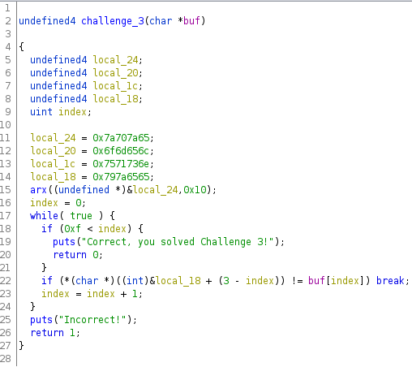
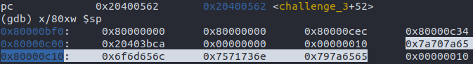
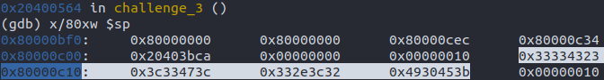

# Challenge 3 Writeup

Solved by **Kevin Park**  
Writeup by **Kevin Park**  

## Decompiled `challenge_3` Function


Right from the bat, you can see that there are 4 random looking integers saved as a
local variable. Then, pointer to one of them gets passed into a function `arx`. It
looks like function `arx` does some manipulation on all 4 variables, but how it
manipulates is not really imporant.


## Ez Pz Lemon GDB
The user input gets matched (in reverse direction) with the 4 variables in a
concatenated manner. So, all we need to know is what `arx` function modified them
into. With GDB, we set a break point at `0x20400562`, right before it jumps into the
function.
```
(gdb) break *0x20400562
```
Then, we simply analyze before and after of the stack memory of those four variables.
### Before `arx` function

### After `arx` function



## Almost Done
`0x33334323 0x3c33473c 0x332e3c32 0x4930453b`  
Now, it's easy to tell that the modified variables are now within the printable ascii
range. Now, all you need to do is get the string value of these in reverse, and you
have your answer.  

Answer: `I0E;3.<2<3G<33C#`